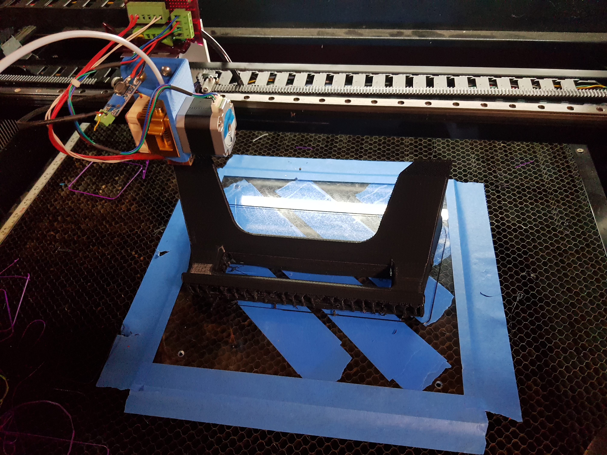
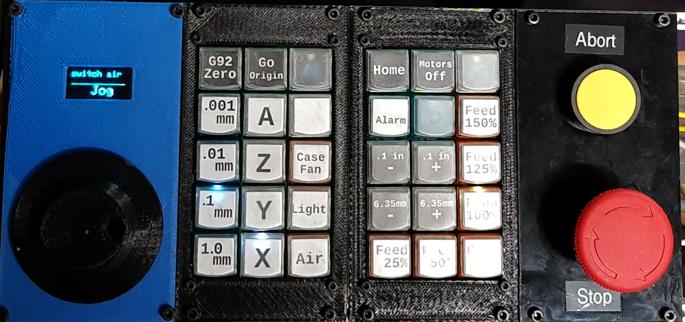

# Bio

Electronics, Software, Hardware, Wood, Metal, 3D, AI, and Business Automation.  Here's a selection of 
 

# CNC Maker Projects
## Large Format 3D Printer & CO2 Laser Cutter

Starting with an 80W CO2 Laser cutter, with the intention of using it as a platform for mechanical experiments.  Replaced the built in Ruida controller with a Smoothboard, and configured for a dual-role as a large format 3D printer and Laser Cutter with swappable heads.

**Primary Goals & Accomplishments:**
* Quick changeover time (<60s)
* No laser re-alignement necessary
* Open Source Software Stack (LaserWeb, Octoprint & Smoothieware)

## X2 Mill CNC (Smoothieboard, Ball Screw Conversion, Air & Flood Coolant, Sheet Metal Enclosure, Tool Touch Probe)
A long-term project, composed of many sub-projects over the years to learn the technical skills necessary to build and customize mechanical systems hands-on.

**Chronological Projects & Accomplishments**
* GRBL based G-Code execution
* Backlash mitigation via conversion to ball screws
* Local Jog Control panel
* Macro buttons w/ G-Code based scripting
* Controller based air coolant
* Sheet Metal Tray & Flood Coolant
* G-Code Control of Flood Coolant
* Load-cell based tool touch probe
* Walls & Doors

