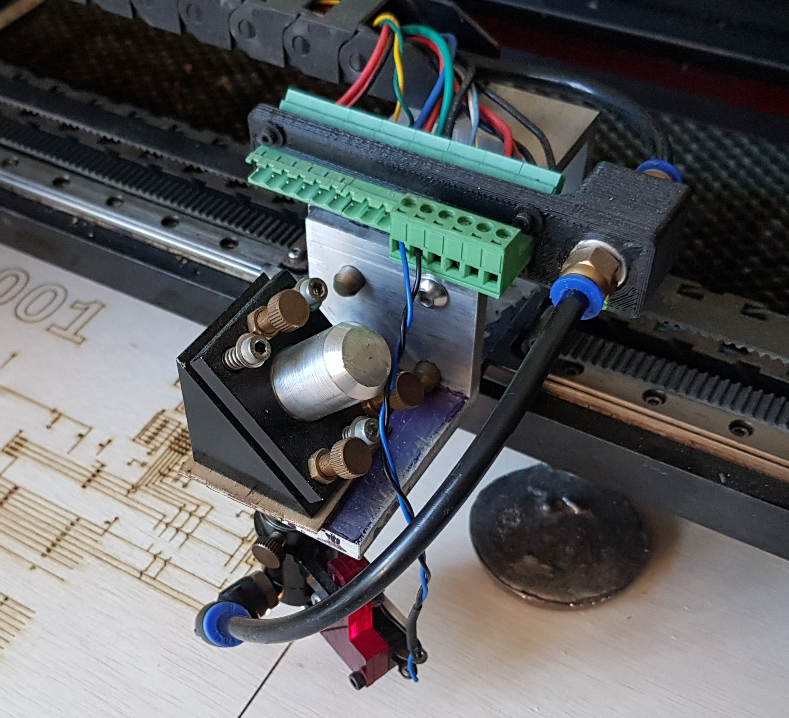

# Bio

Electronics, Software, Hardware, Wood, Metal, 3D, AI, and Business Automation.  Here's a selection of projects and concepts I've worked on and learned from.  Many of them were experimental projects, not finished products.
 

# 3D Printing
I've worked with FDM and MSLA printing, built and customized 3d printers, and done thousands of prints of various mechanical and artistic components.

# CNC Experiments

## X2 Mill CNC (Smoothieboard, Ball Screw Conversion, Air & Flood Coolant, Sheet Metal Enclosure, Tool Touch Probe)
A long-term project, composed of many sub-projects over the years to learn the technical skills necessary to build and customize mechanical systems hands-on.

**Chronological Projects & Accomplishments**
* GRBL based G-Code execution
* Backlash mitigation via conversion to ball screws
* Local Jog Control panel
* Macro buttons w/ G-Code based scripting
* Controller based air coolant
* Sheet Metal Tray & Flood Coolant
* G-Code Control of Flood Coolant
* Load-cell based tool touch probe
* Walls & Doors

## Large Format 3D Printer & CO2 Laser Cutter

Starting with an 80W CO2 Laser cutter, with the intention of using it as a platform for mechanical experiments.  Replaced the built in Ruida controller with a Smoothboard, and configured for a dual-role as a large format 3D printer and Laser Cutter with swappable heads.

As this was my first 3D printer, the build started with bracketry and components laser cut and shaped from acrylic.  As the build progressed, I was able to make usable but ugly parts with FDM, and gradually upgrade the machine.  These projects were built in a time before online ordering of custom 3D prints and machined parts was normal.

**Primary Goals & Accomplishments:**
* Bootstrap the conversion w/ laser cut parts, to build 3D printed parts for the X2 CNC conversion, to build machined parts for all of them.
* Quick changeover time (<60s)
* No laser re-alignement necessary
* Open Source Software Stack (LaserWeb, Octoprint & Smoothieware)

